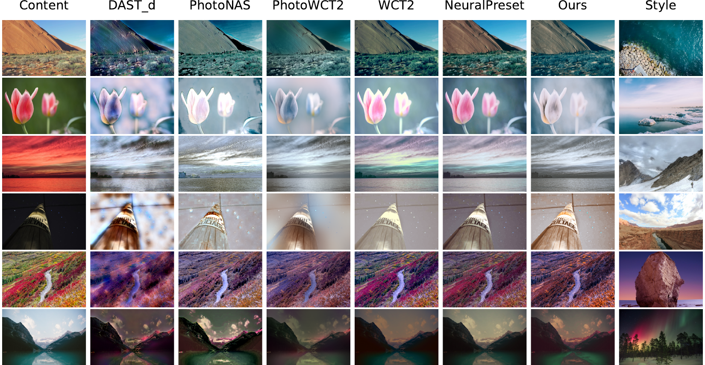
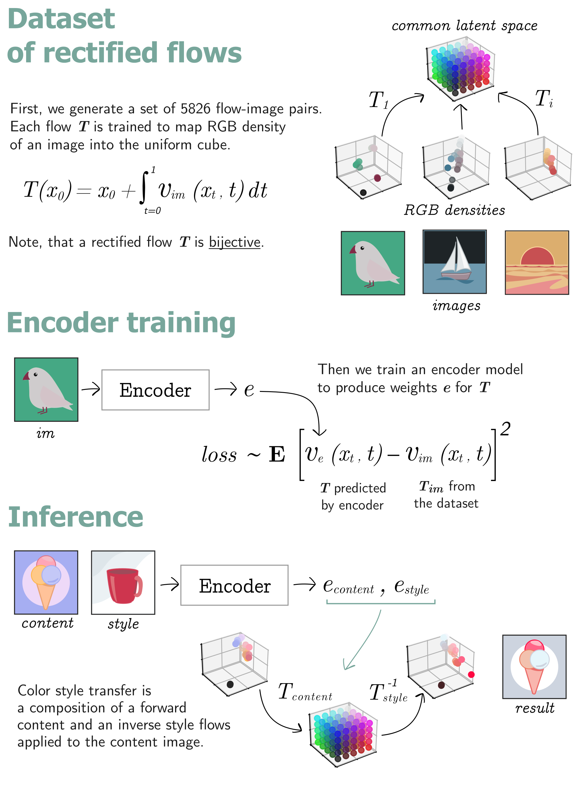

# Color Transfer with Modulated Flows (AAAI 2025)

This is the official implementation of AAAI 2025 paper "Color Transfer with Modulated Flows". 

     

The paper was also presented at ["Workshop SPIGM @ ICML 2024"](https://openreview.net/forum?id=Lztt4WVusu).

Please refer to the
- [huggingface](https://huggingface.co/MariaLarchenko/modflows_color_encoder) for the model checkpoints
- <strong>ModFlows_demo.ipynb</strong> use the pretrained model for color transfer on your own images with the demo jupyter notebook
- <strong>src</strong> directory for models definitions
- <strong>generate_flows_v2</strong> script for training the dataset of rectified flows
- <strong>train_encoder_v2</strong> script for training the encoder

Call `python3 run_inference.py --help` to see a full list of arguments for inference.
`Ctrl+C` cancels the execution.

     

